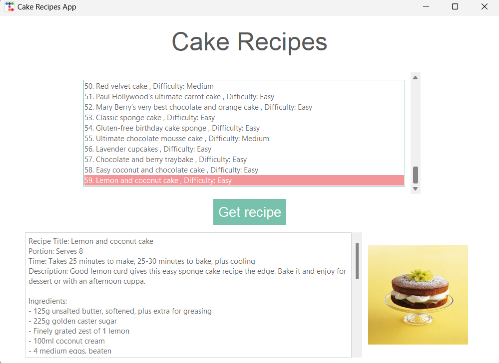

# Cake Recipes Application

## Project Description

The Cake Recipes App is a web application that allows users to browse a list of cakes and retrieve their recipes using a token-based REST API. This application provides a user-friendly interface to explore different cake options and access detailed recipes along with cake photos.

*Graphical User Interface of the app*

## Requirements

Before running the Cake App, make sure you have the following:

- Internet connection: The application requires a stable internet connection to access the API and retrieve cake data.

- Valid API key: Obtain an API key from the service provider.  
The API key is necessary for accessing the API. You can obtain the API key from [the service provider's website](https://rapidapi.com/rapihub-rapihub-default/api/the-birthday-cake-db).

- Python 3: Make sure you have Python 3 installed on your machine.  

- ttkbootstrap library: The Cake App uses the ttkbootstrap library for styling the GUI. You can install it using the following command:  
`pip install ttkbootstrap`

## Getting Started

To use the Cake App, follow the steps below:

1. Clone or download the repository to your local machine.

2. Once you have the API key, open the `recipes_gui.py` file located in the `source/app` directory.

3. In the `__main__` section of the `recipes_gui.py` file, locate the variable named `API_KEY`.

4. Replace the placeholder value of `API_KEY` with your actual API key obtained from the service provider.

5. Save the `recipes_gui.py` file.

6. Launch the Cake App by running the `recipes_gui.py` file.

7. The application will display a list of cakes retrieved from the API.

8. Select a cake from the list to view its recipe.

9. Click on the `Get Recipe` button to retrieve the detailed recipe and see the cake photo.

